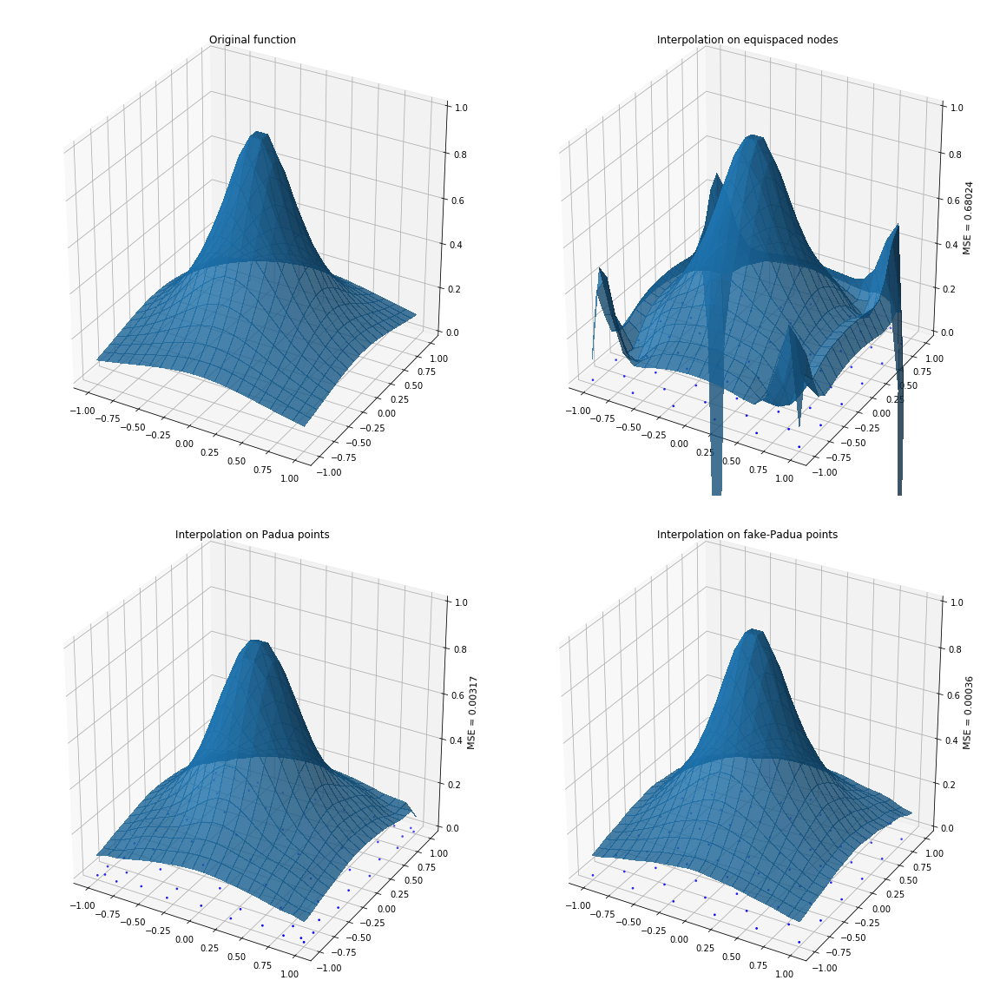
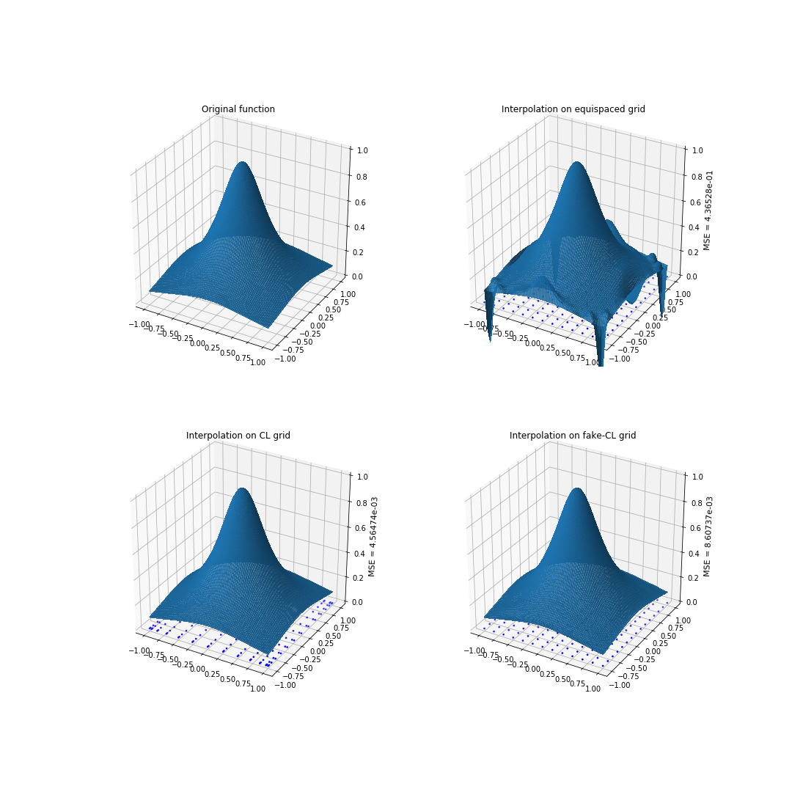

# FakeNodes2D
Bivariate interpolation on Fake Nodes with examples.

## Quote this work

To use this work in any scientific report or publication, please insert in references:

 * S. De Marchi, F. Marchetti, E. Perracchione, D. Poggiali, *Polynomial interpolation via mapped bases without resampling* [link](https://www.sciencedirect.com/science/article/pii/S0377042719303449), JCAM (2020).
 * S. De Marchi, F. Marchetti, E. Perracchione, D. Poggiali, *Multivariate approximation at fake nodes* [link](), preprint.
 * M. Caliari, S. De Marchi, A. Sommariva and M. Vianello, *Padua2DM: fast interpolation and cubature at the Padua points in Matlab/Octave*, Numer. Algorithms 56 (2011)
 * L. Bos, S. De Marchi, A. Sommariva, M. Vianello, *Weakly Admissible Meshes and Discrete Extremal Sets*, Numerical Mathematics: Theory, Methods and Applications, 4(1), 1-12 (2011)

## What are Fake Nodes

Fake Nodes is a novel approach to numerical interpolation that aims to achieve a better interpolation without having to get new samples. You can use your samples as they were taken at better/more representative nodes, cheating with the interpolation domain by applying a map.

Check out out other repos [FakeNodes](https://github.com/pog87/FakeNodes) and [FakeQuadrature](https://github.com/pog87/FakeQuadrature).

